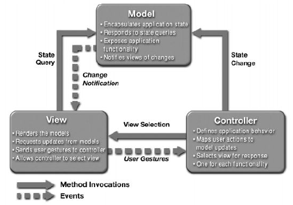

 <br>

# Design Patterns: The Playbook You Didn’t Know You Were Following

There’s a moment in every project where things start to feel… repetitive. Not in a boring way - but in a *familiar* way. You solve one problem, then a slightly different version of it shows up again. You write some logic, then realize you’ve written something similar before. You structure one page, and suddenly every other page starts to look like it. Then you realize that some portions of your code could be refactored into a single file or page, and referenced moving forward. Of course, a new problem shows up that's ever so slightly different, and the cycle repeats.

That was my experience working on the **SRCH Curriculum Builder**.

At first, it felt like I was just building features: courses, objectives, mappings to SRCH content. But over time, I started noticing something else happening in the background. I wasn’t just writing code—I was *reusing code* and *rethinking my approach* to anticipate and solve future issues. And that’s when design patterns stopped feeling like a random topic that we learned about in class but something I didn’t realize I already knew how to do, just without a name for it.

## Not Rules, Not Code—Something in Between

Coding standards are like the lines and rules of a football field - they define the boundaries, penalties and basic expectations so everyone plays in a consistent and organized way. In code, standards do the same thing: naming, formatting and organizing files and rules to keep a project readable and consistent.

But if coding standards are the lines and rules, design patterns are the playbook the team lives by. They are reusable strategies for common situations. During a game, the coach and players don't just create a brand-new play every down - they use the already practiced and refined plays to address a given goal, and design patterns do the same thing. They don’t force you to do something a certain way, nor are they even made specific to a language. They just tell you a structure that tends to work when running into a certain problem type.

Design patterns are described as a *general, reusable solution to a commonly occurring problem in software design*. Initially, that didn't make sense - how could you tell me how to code when you're not even using the same language that I'm using to write my project? But then it hit me - it's not about being given a solution or something to just paste into my project and call it day. They are the approaches to ensure I address the problem in the right way.

When our team first started building the SRCH Curriculum Builder, the goal was simple: let instructors at UH Manoa create courses, define objectives, and map those objectives to SRCH content. While we definitely had lofty expectations of features we were going to include within the time constraint, there definitely wasn't any intentional "architecture decisions" beyond “make it work.” But as the project grew, structure started to matter.

## Separating the Chaos: MVC Without Saying “MVC”

At some point, we realized we were naturally separating things: Database logic lived in Prisma models, UI logic lived in React components, and actions such as create, update, and delete lived in server functions. And while I didn't know any better at the time, that was an example of the **Model–View–Controller (MVC)**, and the goal of MVC is exactly what we were trying to do: Separate data, logic, and presentation so they don’t step on each other.

 <br>

This separation made everything easier - tweaking the UI without touching the database, changing data structures without breaking the frontend, and debugging was made easier because we knew where to look. Of course, it didn't start this way. Too many systems were located all over the place - partially because we were getting used to the transition from individual projects to something we needed to collaborate on, but also because we had each developed our own coding styles that had little quirks that accounted for things like database storage or thinking about the frontend when designing an algorithm. 

Eventually, when natural separation started occuring when we were working on different issues and tasks, it started to work smoother, because those same design goals of the MVC are what ended up working. While it wasn't something we had planned for, or even known about, the MVC model became the natural conclusion of the work we were doing.

## When the UI Reacts Before You Do: Observer in Disguise

Something that took me a little longer to notice as part of the bigger picture to how the UI was updating to changes. When designing a program, aside from any errors or debugging issues, it's easy to take new pop-ups and visual confirmation of changes for granted - the designer programmed it that way. It wasn't until we had some errors we had to debug and I was looking at the database that I realized how quickly the UI was reacting to changes. Submit a form? The data updates, the page refreshes, then the UI reflects the new information automatically. And that, we've come to realize, is the **Observer Pattern**.

The **Observer pattern** essentially states that when one part of the system changes, other parts are automatically notified and updated. While I didn't necessarily write a special notification system, React and Next.js handled that communication automatically through state updates and re-rendering. Sometimes you’re not implementing the pattern directly, you’re using tools that already follow it.

## Creating Something that Creates Something Else: Factory Behavior

When we wrote server actions like:

```TypeScript
export async function mapSRCHContent(formData: FormData) {
  const objectiveId = formData.get('objectiveId');
  const srchContentId = formData.get('srchContentId');
  ...
  return prisma.objectiveMapping.create({
    data: {
      objectiveId,
      srchContentId,
    },
  });
}
```

We were solving a very specific problem - How to consistently create objects without repeating logic everywhere? That’s essentially the **Factory pattern**: Centralizing creation while both hiding complexity and keeping things consistent. It's a way to create objects without exposing all the underlying logic every single time its needed.

## Patterns Aren’t the Goal — They’re the Result

One important thing we’ve learned is that patterns are not the goal, or something that should be used just for the sake of using them. In fact, forcing them can make things worse, essentially becoming an anti-pattern. There were plenty of times where we could have added more abstraction, created extra layers, or forced a new structure that "appeared" cleaner. However, there are times where the simplest solution is the right one, and patterns should help your design, not control it.

## So What Are Design Patterns, Really?

After working through our project, I don’t think of design patterns as something you memorize for interviews anymore. I think of them as recognized ways of structuring solutions that emerge when you try to solve real problems more than once. They aren't rules, code, or even required, but they *are* reusable ideas that avoid having to relearn the same lessons over and over again.  And that’s the part that makes them stick, because I’ll keep adding new plays to my playbook—I just won’t always realize that what feels like a new solution is often something that’s already been practiced, refined, and written down somewhere else.

## Note on AI usage:

The artificial AI tools ChatGPT and Grammarly AI were used primarily to develop the structuring of this essay, to include checking to ensure requirements were met. However, all design direction and writing reflect my own understanding and knowledge of what is possible within the software engineering and design pattern topics discussed in class.
