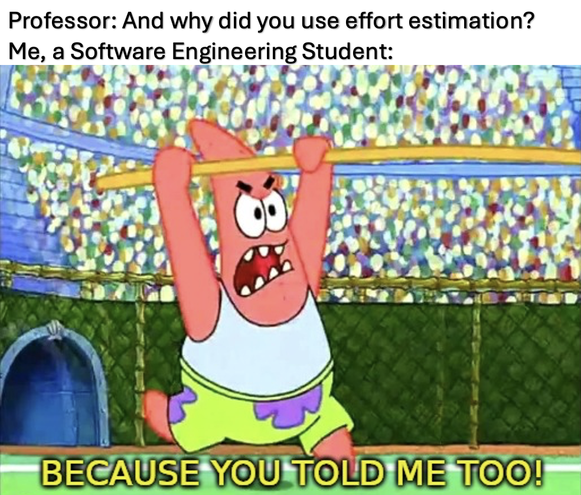
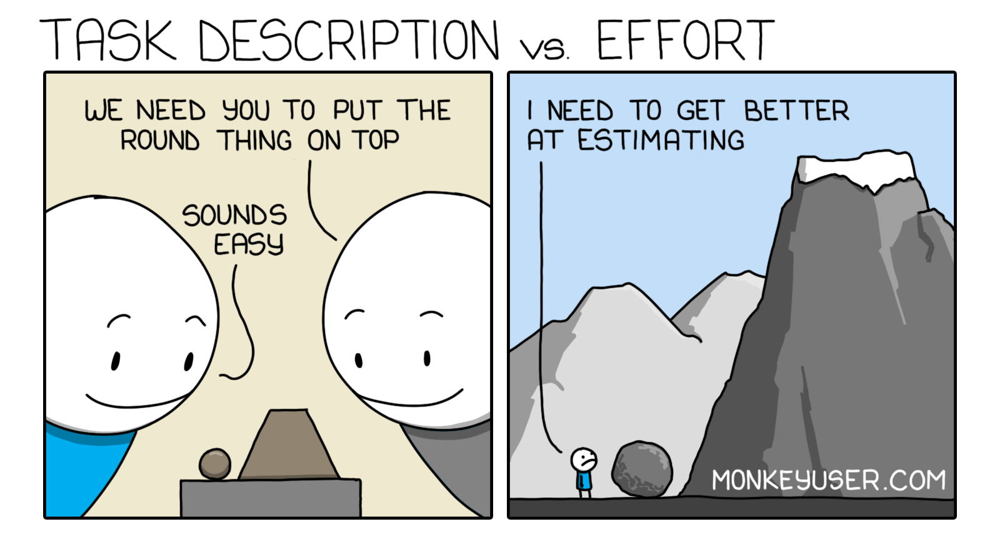
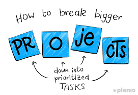

  

## Effort Estimation and Tracking Reflection

When I first approached effort estimation in my SRCH curriculum builder project, I treated it as a way to predict how long it would take me to *code* something. It felt like an extra step —something administrative rather than something meaningful. If I already knew what I wanted to build, why not just build it?

What I didn’t realize at the time was that I wasn’t estimating coding time — I was estimating the entire process of understanding a problem, designing a solution, and making it actually work. That difference became clear very quickly. Tasks that seemed simple at first grew more complex once I accounted for integration, debugging, and decision-making along the way.

Over time, effort estimation stopped feeling like a guess and started feeling like a lens. It didn’t tell me exactly how long something would take, but it helped me see the full scope of the work I was about to do.

## The Effort in Effort Estimation

My initial estimates were based heavily on intuition and comparison. If I had done something similar before, I used that experience as a baseline.

For example, when implementing the “Create Course” feature in SRCH, I estimated around 45–90 minutes based on prior experience with forms and database writes. When I later worked on the “Edit Course” feature, I reused that estimate because the components—form handling, Prisma updates, and routing—were similar.

However, that approach became less reliable when working on more complex features. Mapping SRCH content to course objectives was a good example. While I had seen similar concepts before, integrating them into a full application was different. I had to think through UI selection, database structure, and how mappings would appear to the user. Even without writing it down, breaking the task into these parts helped me avoid completely guessing.

I also began accounting for uncertainty. Authentication and session handling, especially with NextAuth, consistently introduced unexpected issues. One example was a login failure on the deployed site that appeared random at first but was caused by inconsistent password handling. Situations like this reinforced the idea that estimation needed to include not just implementation, but the likelihood of things going wrong.

Even though my estimates were often inaccurate, they were grounded in real reasoning — and that made them useful.

  

## Estimating Effort - Is it worth the time?

Yes — but not because the numbers were correct.

The real value of estimating was that it forced me to think before I acted. For example, when estimating the SRCH content mapping feature, I initially saw it as a simple UI task. But while estimating, I realized it required backend support, server actions, and proper data display. That realization changed my approach before I even started coding.

Estimating also helped with prioritization. Smaller tasks, like fixing routing issues, could be completed quickly, while larger tasks, like integrating multiple features, required more focused time. This made it easier to decide what to work on depending on how much time I had available.

Most importantly, estimating created a baseline that I could compare other issues and efforts against. That comparison is what made patterns visible — especially how often I underestimated tasks that involved integration across multiple parts of the system.

## The Role of Non-Coding Effort

One of the most important lessons from this experience was understanding how much non-coding effort contributes to total development time.

In many cases, coding itself was the shortest part of the task. The majority of time was spent on planning, researching, debugging, and understanding how different components interacted.

For example, when implementing SRCH content mapping, writing the server action was relatively quick. However, deciding how mappings should be structured, how they should appear in the UI, and how they connected to existing course data took significantly more time.

This pattern appeared consistently across the project. Debugging Prisma issues, researching authentication behavior, and verifying deployment behavior on Vercel often took longer than writing the code itself.

Because I initially focused only on coding time, my estimates were consistently low. Once I began recognizing non-coding effort as a core part of development, my understanding of estimation improved significantly. Accurate estimation, I realized, is not about predicting how long it takes to write code — it is about understanding the full process surrounding that code.

  

## Was Tracking Actual Effort Useful?

Tracking actual effort was the point where everything started to make sense. In my SRCH project, tasks estimated at around 60 minutes often took closer to 90–120 minutes once debugging and testing were included. A strong example was implementing protected routes. The initial logic was straightforward, but ensuring correct session handling, redirect behavior, and deployment compatibility required much more time.

Similarly, debugging Prisma errors—such as failed queries or unexpected 404 routes—required investigating schemas, reseeding the database, and verifying routing logic. Without tracking, these would have been remembered as quick fixes. The data showed otherwise.

Tracking also influenced how I worked. During Milestone 2, when I had to redesign large parts of the project, I realized that working on large, undefined tasks made both tracking and estimation difficult. Breaking those tasks into smaller pieces not only improved estimation accuracy but also made the work itself more manageable. This shift wasn’t about becoming better at coding—it was about structuring work more effectively.

## How I Tracked My Effort

My tracking process was mostly manual. I tracked coding effort as time spent writing, debugging, and integrating code, and non-coding effort as time spent planning, researching, and thinking through problems. At the beginning of the project, I relied more on intuition than structured tracking. Over time, I became more consistent, although I still occasionally estimated time after the fact rather than recording it immediately.

Because of this, my data was not perfectly precise. However, it was accurate enough to reveal patterns — especially the consistent gap between estimated and actual effort.

## What I Would Change Next Time

If I were to repeat this process, I would make several improvements:

- Break tasks into smaller, clearly defined components before estimating  
- Track effort in real time using a dedicated tool  
- More deliberately account for non-coding effort  
- Add a buffer to account for uncertainty and debugging  

Rather than aiming for perfect estimates, I would focus on building a consistent and informed estimation process.

## AI Usage

I used AI tools throughout the SRCH project primarily for debugging and understanding implementation patterns.

- **Tool Used:** ChatGPT, Claude, Google Gemini

- **Example Prompts:**  
  - “How should I structure a server action for mapping content to an objective?”  
  - “Why is my Prisma query returning undefined?”  
  - “How do I protect routes using NextAuth in Next.js?”

- **Time Breakdown:**
  - Prompt engineering: ~10–15 minutes  
  - Generation time: negligible  
  - Verification and debugging: ~15–30 minutes  

AI helped accelerate problem-solving, particularly when dealing with framework-specific issues. However, most responses required modification and verification. Integrating AI-generated solutions into the project still required debugging and adaptation. In that sense, AI did not eliminate effort — it redistributed it.

## Effort Estimation: The Definition of Work Smarter

At the start of this project, effort estimation felt like an unnecessary step — something separate from the “real work” of coding. By the end, it became clear that estimation *is* part of the real work. Estimating forced me to think before building. Tracking showed me where my time was actually going. Together, they revealed something I hadn’t fully understood before: software development is not just about writing code. It is about planning, debugging, integrating, and adapting when things do not go as expected.

If there is one takeaway from this experience, it is that the work you see is only part of the work you do. Effort estimation does not make that work easier—but it makes it visible. And once it is visible, it becomes something you can improve.

## Use Of AI (Essay)

ChatGPT and Grammarly were used to assist the structuring and organization of this essay, along with ensuring all requirements were met. However, all ideas presented in this essay our my own, and beyond changes for grammar, reflect my understanding of Software Engineering from class, as well as my own experiences in developing the SRCH Builder project.
