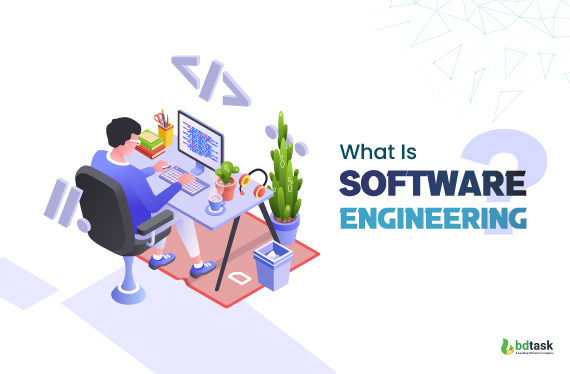
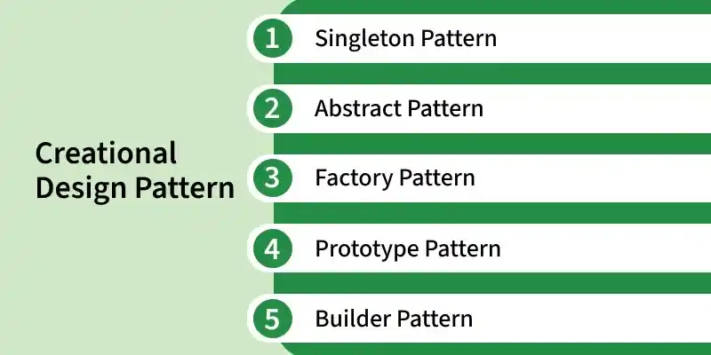
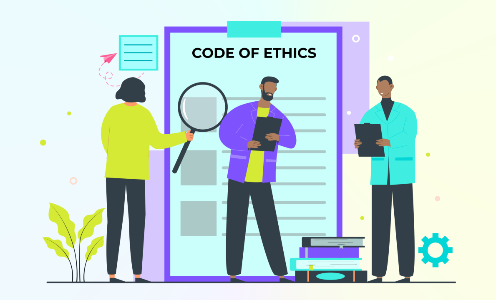

  

## Introduction

Before taking ICS 314, I viewed software engineering similarly to how someone might view constructing a building: if the structure stood upright and looked complete, then the job was finished. Sure, with a little more insight such as working or living in a building, you recoginize there are other things that need for it to be complete, such as plumbing, electricity and the like. However, at a glace, the building is "complete". Similarly, as long as the code worked and produced the correct output, I considered the software successful. What I failed to recognize was that key insight - that the visible product is only a small part of what makes a system functional over time.

A building is not judged solely on whether it stands the day it is completed. Its structure must remain understandable to future architects, maintainable by engineers, and reliable for the people depending on it for the duration of its use. The documentation behind the structure is created and maintained so that current occupants and workers can ensure that the building meets requirements and can be adjusted for future needs, or so that the company can use those documents for future expansions or new buldings. Software engineering follows the same principle. Writing code is only one layer of a much larger process involving communication, organization, scalability, and responsibility.

Although ICS 314 primarily used web application development as the medium for instruction, the course itself was never just about building websites. The larger lessons came from the engineering principles behind what we were building — concepts such as coding standards, design patterns, and ethics in software engineering. These ideas extend far beyond web development because they address problems that appear in nearly every area of software: how teams communicate through code, how systems remain maintainable as they grow, and how developers balance technical decisions with responsibility toward users and other engineers. The biggest shift in my perspective throughout this course was realizing that software engineering is not simply about creating programs that work - It is about creating systems that others can understand, trust, maintain, and continue improving long after the original project was complete.

  

## Coding Standards: Writing Code for Humans

At first, coding standards seemed restrictive. Rules about indentation, naming conventions, file structure, or ESLint warnings felt more like obstacles than helpful tools. If the code worked, it was easy to question why formatting mattered so much, especially for some errors in ESLint where ignoring it actually didn't affect the functionality of the program. Over time, though, I realized coding standards weren't there to satisfy some subjective code, but they were absolutely important - not as a tool for functionality, but as a tool of communication.

Coding standards create consistency between developers so that code becomes easier to read, debug, and maintain. When every developer structures code differently, even simple projects become difficult to navigate. In larger systems, inconsistency can quickly become chaos. ESLint and formatting rules initially felt frustrating, especially when they flagged code that technically still worked, but those standards prevented many small problems from becoming larger ones later. One example of this came up repeatedly during the SRCH curriculum builder project. 

As the application grew, files became larger, more interconnected, and harder to navigate without in-depth knowledge of how it was written. One thing that immediately caused issues was both my own and my groupmates habits of not implementing a simple standard - annotating our code and their functions. Without consistent naming conventions and organization, it became significantly harder to identify where certain logic was implemented. In many cases, the resulting solution devolved into either having the group come together to talk through our sections of code, or having one person re-read through all the code to debug issues. 

Coding standards also became important when using AI-assisted development tools like ChatGPT or GitHub Copilot. In many cases, AI-generated code often worked functionally and possibily addressed an issue, but it did not always follow the project’s structure or style conventions. Because of this, understanding and enforcing coding standards became even more important. It was not enough for code to simply run — it needed to fit into the larger system cleanly and predictably. Additionally, it also had to be well understood or adjusted so that future debugging or adding of features didn't add extra time to development just because we couldn't identify quickly what part of the code needed adjusting.

What surprised me most was realizing that coding standards are less about computers and more about teamwork. They allow developers to quickly understand each other’s intentions and reduce unnecessary confusion. Even outside web development, this principle applies almost everywhere software exists — working on a group document where everyone follows the same formatting structure, collaborating on engineering blueprints that rely on standardized symbols, or even organizing files in a shared workspace so others can immediately understand what they are looking at. In each case, consistency is what allows multiple people to work efficiently without constantly stopping to reinterpret someone else’s decisions. Ultimately, coding standards are not restrictions placed on developers; they are systems designed to make collaboration sustainable as projects and teams grow larger.

  

## Design Patterns: The Playbook of Software Engineering

One of the most interesting concepts from the course was design patterns. Before ICS 314, I often viewed programming problems as something in isolation, completely unique and requiring its own solution. As I gained more experience through this course, I started realizing that many software problems repeat themselves — and experienced developers have already created reliable methods for solving them.

A design pattern is essentially a reusable solution to a common software problem. It is not copied code, but rather a structured way of thinking about system design.

The easiest analogy I found for understanding design patterns is comparing them to a football playbook. A football team does not invent a completely new strategy every single play. Instead, teams rely on proven formations and plays that can be adapted depending on the situation. Software engineering works similarly - Developers use established patterns because they are tested, understandable, and maintainable.

Throughout my SRCH project, I began recognizing patterns in areas like:

- reusable React components
  
- shared form structures
  
- server actions
  
- separating frontend and backend responsibilities.

For example, during the SRCH curriculum builder project, creating both “Create Course” and “Edit Course” pages helped me recognize the value of reusable structures. Instead of duplicating large sections of code, I learned how creating shared components simplified maintenance and improved readability. That experience made design patterns feel practical instead of theoretical - something that comes inherently as a result of making code easier for re-use.

Design patterns also changed how I approached debugging. Instead of only asking “What is broken?”, I started asking “What pattern is this code trying to follow?” In many cases, understanding the intended structure made identifying issues significantly easier. For example, if a reusable component suddenly behaved differently from the rest of the application, the issue was often not the logic itself, but the fact that the component had drifted away from the  pattern the rest of the program was using. That shift  made debugging feel less like searching at random for mistakes and more like tracing where the structure of the system stopped being consistent.

Most importantly, design patterns showed me that software engineering is not just about solving problems — it is about solving problems in ways that remain understandable and scalable over time.

  

## Ethics in Software Engineering: Responsibility Beyond the Screen

Ethics was probably the topic I underestimated the most before taking this course. Initially, software ethics sounded strange compared to technical concepts like frameworks or programming languages, something that didn't really align with the course. Of course, I understood that there are ethical decisions for the intent of the program, but how does that apply to what were actually coding? Questions like these are what made ethics in Software Engineering seem abstract. However, throughout the semester, I realized that software engineers make decisions that directly affect users, organizations, and society as a whole. Because of that, engineering decisions are never purely in the realm of "technical" - its something we must be conscious of as we move forward in this profession.

One ethical consideration that became increasingly important throughout the course was the use of AI tools in development. Tools like ChatGPT and GitHub Copilot can significantly improve productivity, but they also create responsibilities. Developers still need to verify outputs, understand generated code, and ensure they are not blindly trusting incorrect or insecure solutions.

I noticed this personally during debugging sessions. AI could often identify likely causes quickly, but it was still my responsibility to verify whether the solution actually fit my application. In some cases, generated solutions introduced new issues or relied on assumptions - whether that be from a lack of appropriate prompting - an entirely different skill set on its own - or because the answer didn't fit the specific setup being used at that time. That experience reinforced an important ethical principle: responsibility for software always belongs to the developer, not the tool being used to create the product.

Security and reliability also became more meaningful topics during deployment and authentication work. A small mistake involving user authentication or database handling could affect real users in real systems. Even though class projects are educational environments, the same principles apply in professional settings where software failures can impact privacy, finances, or safety.

Ultimately, ethics in software engineering is not limited to controversies or obvious misuse of technology. It appears in everyday decisions — verifying code before deployment, protecting user information, properly testing systems, and understanding the consequences of the tools we choose to rely on. The course helped me realize that being a software engineer is not just about building systems that function, but about building systems responsibly.

## Conclusion

Before ICS 314, I thought software engineering was mainly about writing code that worked. By the end of the course, I realized software engineering is much broader than that. Coding standards taught me that code is written for people just as much as the system its designed for. Design patterns showed me that experienced developers solve recurring problems through reusable structures rather than constantly reinventing solutions. Ethics demonstrated that technical decisions always carry consequences and responsibilities.

Although the course focused heavily on web application development, the principles behind these topics extend beyond applications and systems. They apply to nearly every environment where software is involved because they focus on maintainability, collaboration, and responsibility. The biggest lesson I learned is that software engineering is not simply the process of creating software - It is the process of creating something that other people can trust, understand, and continue building long after the original developer is gone.

## Note on AI Usage:

The artificial AI tools ChatGPT and Grammarly AI were used primarily to develop the structuring of this essay, to include checking to ensure requirements were met. However, all design direction and writing reflect my own understanding and knowledge of what is possible within the software engineering and design pattern topics discussed in class.
