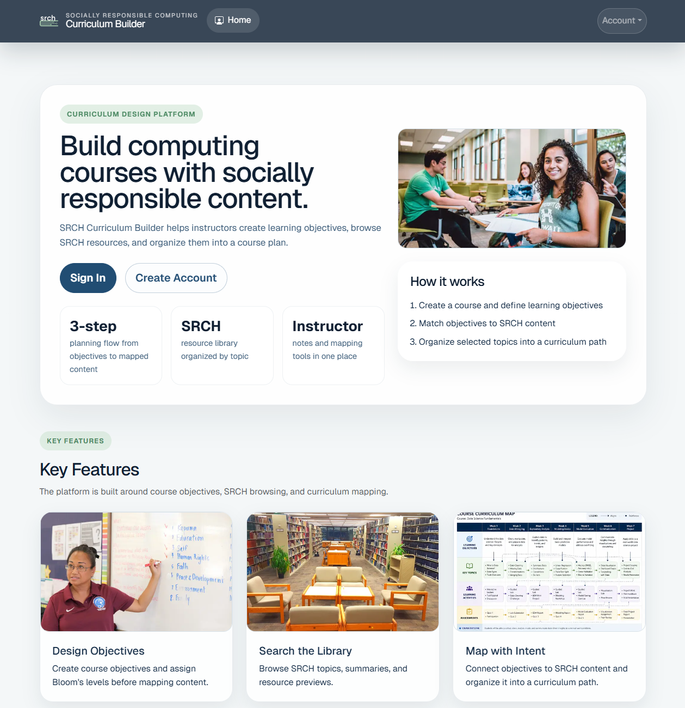
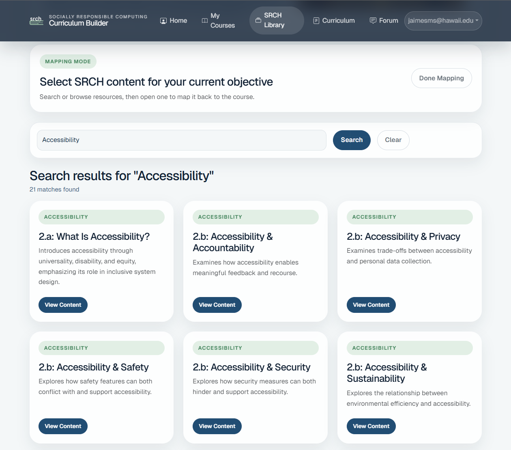

 <br>

# SRCH Curriculum Builder

The SRCH Curriculum Builder is a web application designed to help instructors at UH Manoa connect course learning objectives to educational resources within the SRC Handbook - an actively developed resource by Brown Univeristy. The SRCH is a guide for integrating ethics, responsibilty, and social awareness into computer science teaching. 

Rather than treating SRCH as a static textbook, the system approaches it as a searchable academic resource library where instructors can browse topics, map content directly to objectives, and document how each resource supports the curriculum. The platform allows users to build courses, create learning objectives using Bloom’s Taxonomy levels, map SRCH content to those objectives, and generate curriculum views that visually connect instructional goals to supporting materials.

One of the primary goals of the project was to improve how instructors organize and reuse curriculum resources. Instead of manually tracking references across documents, the application centralizes course planning into a single system. Features such as objective-to-resource mapping, curriculum visualization, reusable objectives, and instructor notes were designed to support both course planning and collaboration between instructors. Additional functionality includes the ability to browse SRCH topics, search content, copy objectives from other users’ curricula into personal courses, and maintain structured mappings between objectives and educational resources.

## Role and Contributions

My role in the project focused heavily on full-stack application development, database integration, authentication, UI implementation, and testing. I worked on both frontend and backend portions of the system using Next.js, TypeScript, React Bootstrap, Prisma, PostgreSQL, and NextAuth.

Some of my primary contributions included:

- Designing the overall concept and design approach for integration
- Creating course and objective management pages
- Building curriculum visualization pages
- Developing the SRCH browser and content mapping workflows
- Adding features that allow instructors to reuse objectives from other curricula
- Creating Playwright end-to-end testing for authentication flows and page validation

A large portion of my work involved designing how the application handled curriculum relationships and ownership. For example, when users browse another instructor’s curriculum, they can reuse objectives as templates without modifying the original owner’s content:

```ts
await prisma.objectiveContentMap.upsert({
  where: {
    learningObjectiveId_srchContentId: {
      learningObjectiveId: objectiveId,
      srchContentId: contentId,
    },
  },
  update: { isSelected: true },
  create: {
    learningObjectiveId: objectiveId,
    srchContentId: contentId,
    isSelected: true,
  },
});
```

This required building workflows that preload objective data into new objective forms while safely copying SRCH mappings into the new course context. I also implemented improvements to the SRCH mapping experience, including workflows that allowed instructors to continue selecting multiple resources before returning to their course page.

 <br>

## Technical Experience and Lessons Learned

Throughout the project, I gained significant experience working with modern full-stack web development workflows. I learned how to:
- Structure Next.js App Router projects
- Manage secure server actions
- Integrate Prisma with PostgreSQL
- Design reusable React components
- Debug authentication and routing issues
- Manage database seed data
- Build reliable Playwright tests that run both locally and in CI environments

One of the most valuable lessons from the project was understanding how important maintainability and system design become as applications grow. Features that initially seemed isolated eventually interacted with authentication, database ownership rules, routing behavior, and testing infrastructure.

Working through these integrations helped me better understand how software architecture decisions affect scalability, maintainability, and user experience. The project also reinforced the importance of source control practices such as:
- Feature branching
- Isolated pull requests
- Incremental testing
- Collaborative development workflows

## Technologies Used

- Next.js (App Router)
- TypeScript
- React Bootstrap
- Prisma ORM
- PostgreSQL
- NextAuth
- Playwright
- Vercel

## Contributions Summary

- Developed course creation, editing, and curriculum management workflows
- Built learning objective creation and editing functionality
- Implemented SRCH content browsing and mapping workflows
- Added curriculum visualization pages linking objectives to SRCH resources
- Designed reusable objective workflows between instructor curricula
- Created Playwright end-to-end tests for forms, authentication, and page availability
- Added seed data support for users, courses, objectives, and SRCH mappings

## Source Code

GitHub Repository: [Manoa SRCH Repo](https://github.com/manoa-srch/srch-application-project)
Deployed Application: [Manoa SRCH Curriculum Builder](https://srch.zacklown.com)
Organization Page: [Manoa SRCH Team](https://manoa-srch.github.io/)
