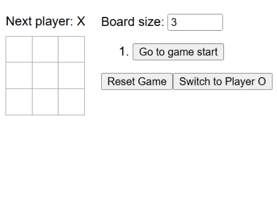

 <br>

This React Tic-Tac-Toe project was developed during ICS 314 as a way to practice building interactive frontend applications with React. While the original concept started as a standard Tic-Tac-Toe game, the project evolved after adding additional features such as adjustable board sizes, a computer-controlled opponent, and tracking move history. The goal of the project was less about recreating the game itself and more about understanding how React applications manage changing data and continuously update the interface based on user interaction.

One of the main goals of the project was to gain experience working with React’s component-based architecture and state-driven rendering system. The application allows players to interact with a dynamically generated game board while the interface continuously updates based on user actions and game conditions. As the project developed, additional functionality such as board resizing and replay tracking introduced more complex state management requirements that helped simulate the challenges of larger frontend applications.

The project also served as experience in organizing frontend application logic. Instead of building the game as a single large component, I worked on separating the interface into reusable React components responsible for different parts of the application. This improved maintainability and made debugging significantly easier as the project grew in complexity.

## Technologies Used

This project was developed using:

- React
- JavaScript
- JSX
- CSS
- React Hooks and State Management

The application was an exercise in frontend programming concepts such as reusable components, dynamic UI generation, event handling, and interactive application state updates.

## Features

- Adjustable board sizes
- Computer-controlled opponent
- Move history tracking
- Selectable player sides
- Dynamic game state updates
- Replay and reset functionality
- Interactive UI controls

These additions made the project substantially more complex than a traditional Tic-Tac-Toe implementation and provided experience managing multiple interconnected pieces of application state simultaneously.

## What I Worked On

My role in the project focused on implementing the frontend game logic and interactive behavior using React. I worked on:

- Dynamically rendering the game board
- Tracking and updating player turns
- Managing move history and replay functionality
- Handling board resizing logic
- Creating reset and restart features
- Implementing the computer-controlled opponent
- Updating the interface based on game outcomes
- Structuring reusable React components
- Designing event handlers for user interaction

I also spent time debugging issues related to state updates and conditional rendering, especially as new features increased the complexity of the application. Because many parts of the interface depended on shared game state, careful organization of component logic became increasingly important.

## Lessons Learned

This project gave me practical experience building interactive applications with React and managing dynamic frontend state. I became more comfortable working with reusable components, event handling, conditional rendering, and debugging state-related issues as the application became more complex. The project also helped reinforce the importance of organizing application logic clearly, especially when multiple features depend on shared state and user interaction.

## Example Code

The following snippet demonstrates part of the reusable React component logic used for rendering an individual game square and handling user interaction:

```jsx
function Square({ value, onSquareClick }) {
  return (
    <button className="square" onClick={onSquareClick}>
      {value}
    </button>
  );
}
```

## Source Code

GitHub Repository: [React Tic-Tac-Toe](https://github.com/jmexias/react-tic-tac-toe)
