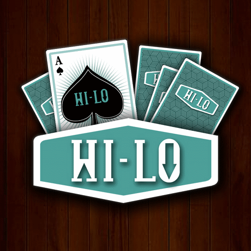

<div class="text-center p-4">
  
</div>

HiLo Card Game is a project that was developed for a class during the fall semester of 2024 at Leeward Community College. The program allows for the user to play a java, text based game that allows the user to play against the computer in a game of "High or Low", using an input integer as a bankroll to place bets on the next hand.

For this project, I was developed the program based on a given java file that instantiated the deck of cards, as well as functions for drawing a new card and comparing the drawn card against the played card. I started by programming the front end experience for the user, ensuring the correct messages were prepared depending on the current situation in the game.  From there, a large portion of my time was spent coding the comparisons between the randomly drawn card, the card it was compared to, and the implementation of adjusting the players bankroll appropriately. I also worked to ensure that there were proper exit measures from the program, either through user prompt or if the player lost all their bankroll.

Here is some code that illustrates the exit or continuation process that is dependant on if the player has a remaining bankroll:

```cpp
if(bankroll == 0) {
  System.out.println("You've run out of money!");
  System.out.println("Please come back and try again!");
}
else {
  System.out.println("Would you like to continue?");
  System.out.print("Enter C to continue, or Q to quit: ");

  playerGuess = scan.nextLine();
```
