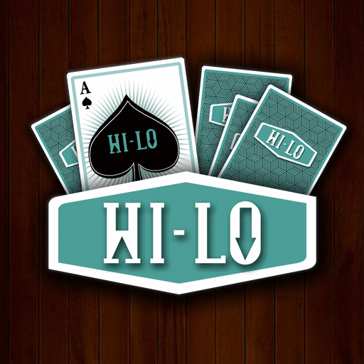

<div class="text-center p-4">
  
</div>

The HiLo Card Game was developed as part of a software development course at Leeward Community College during the Fall 2024 semester. The project focused on building a text-based Java application that simulated a betting-style version of the classic “High or Low” card game. Players begin with a user-defined bankroll and place wagers on whether the next randomly drawn card will be higher or lower than the current card in play.

The project provided experience with core programming concepts such as conditional logic, loops, user input validation, randomization, and state management. While portions of the card deck implementation and card drawing functionality were provided as starter code, I was responsible for designing and implementing the primary gameplay systems and user interaction flow. This included developing the betting logic, comparing drawn cards, updating the player’s bankroll after each round, and managing the progression of the game based on player decisions and game outcomes.

A significant portion of the project involved improving the overall user experience of the command-line interface. I implemented prompts and feedback messages that adapted to different game states, such as wins, losses, invalid inputs, and end-game scenarios. I also developed logic to properly terminate or continue the game depending on the player's bankroll and menu selections. Through this project, I gained practical experience organizing application logic, debugging conditional workflows, and designing interactive software systems using Java.

The project also reinforced the importance of writing maintainable and readable code. As the gameplay logic became more complex, I learned how to structure conditions clearly and separate responsibilities within the program to make testing and debugging easier. This experience helped strengthen my understanding of how even smaller software projects benefit from thoughtful program structure and user-focused design decisions.

## Example Code

The following snippet demonstrates part of the game continuation logic that determines whether the player can continue playing based on their remaining bankroll:

```java
if (bankroll == 0) {
  System.out.println("You've run out of money!");
  System.out.println("Please come back and try again!");
} else {
  System.out.println("Would you like to continue?");
  System.out.print("Enter C to continue, or Q to quit: ");

  playerGuess = scan.nextLine();
}
```

## Skills and Technologies

- Java
- Object-Oriented Programming
- Conditional Logic
- User Input Validation
- Command-Line Interface Design
- Debugging and Testing

## Source Code
Repository: [Hi-Lo Card Game](https://drive.google.com/drive/folders/1qD_pqYEYeBNlivNCKsP0ClCxvlBCufr-?usp=sharing)
