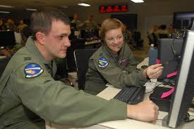

  

I served as the Integrated Joint Fires Center (IJFC) subject matter expert for the Joint Warfighter Experiment (JWX) in Suffolk, VA from 10 September 2023 - 22 September 2023. I played an integral role in a combined & joint experiment that informed the development of the Joint Fires Network for the USINDOPACOM Commander. Some of these contributions introduced new ways to enhance new technologies & tools, as well as led an accelerated joint tasking order cycle, integrating multi-service options within an area of responsibility. 

During the exercise, many of my contributions were coordnation of aerial assets assoiciated with the collection of information across a virtual battlefield. I advised other fire teams on the availability of the aformentioned assets, the reported information aligned to the target area, and the coordination for recieving the appropriate imagery (either pictures/capabilities captured by radars, cameras, or full motion video cameras) through the correct legal means.

Some of my time during the exercise revolved around working with the developers of the prototype software (Lockheed Martin) we were using in order to further refine the softwares capabilities and readability for the end user. Much of this work revolved around finding issues with the software to include login credentialing not working across networks, errors in updated information when the systems would sync, reporting of unusable functions that users should have been capable of, and other similar issues. 
