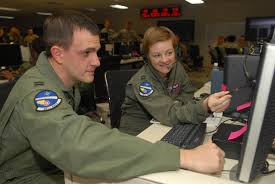

  

I served as the Integrated Joint Fires Center (IJFC) subject matter expert during the Joint Warfighter Experiment (JWX) conducted in Suffolk, Virginia from September 10–22, 2023. The exercise supported the continued development and evaluation of the Joint Fires Network for the United States Indo-Pacific Command (USINDOPACOM). The event brought together military personnel, operational planners, and software developers to test new systems and workflows intended to improve coordination and decision-making across joint military operations.

My role during the exercise focused heavily on operational coordination, information management, and supporting the integration of emerging software tools into real-world workflows. Much of my work involved coordinating aerial collection assets responsible for gathering intelligence and battlefield information across the simulated operational environment. I advised fire support teams on the availability and capabilities of these assets, coordinated the distribution of imagery and sensor data, and helped ensure that information was requested and shared through the proper legal and operational channels. This included working with radar imagery, camera systems, and full-motion video feeds used to support targeting and situational awareness.

Another major part of my involvement centered around working directly with the developers of the prototype software systems being tested during the exercise. I collaborated with software engineers and support personnel from Lockheed Martin to provide operational feedback on the usability, reliability, and effectiveness of the tools being evaluated. This included identifying synchronization issues across networks, troubleshooting login credential problems, reporting broken or inaccessible functions, and recommending improvements related to workflow efficiency and interface readability from the perspective of the end user.

One of the most valuable aspects of the experience was seeing how software development and operational requirements interact in high-pressure environments. The exercise reinforced the importance of clear communication between developers and end users, especially when systems are expected to support real-time decision-making. I gained a better understanding of how software testing, user feedback, and iterative refinement contribute to improving operational systems before they are deployed in larger environments.

The project also strengthened my skills in teamwork, time management, and problem-solving under pressure. Because the exercise involved multiple organizations, services, and operational objectives working simultaneously, effective coordination and adaptability were critical. The experience gave me insight into how large-scale systems are tested collaboratively and how software development can directly influence operational effectiveness in complex environments.

## Contributions

- Coordinated aerial intelligence collection assets during simulated operations
- Assisted with operational information management and imagery distribution
- Provided end-user feedback to software developers and engineers
- Identified synchronization and credentialing issues within prototype systems
- Assisted with usability testing and workflow evaluation
- Supported joint operational planning and accelerated tasking workflows

## Skills & Technologies

- Operational Systems Testing
- Software Evaluation
- Cross-Team Collaboration
- Information Coordination
- Problem Solving
- Time Management
- Joint Operations Support

## Additional Information

Due to the operational and security-sensitive nature of this work, source code, internal systems, and supporting documentation associated with the exercise are not publicly available. Much of the software and operational information involved in the Joint Warfighter Experiment was developed for or owned by USINDOPACOM and supporting defense contractors, with access restricted based on security clearance and operational need-to-know requirements.
