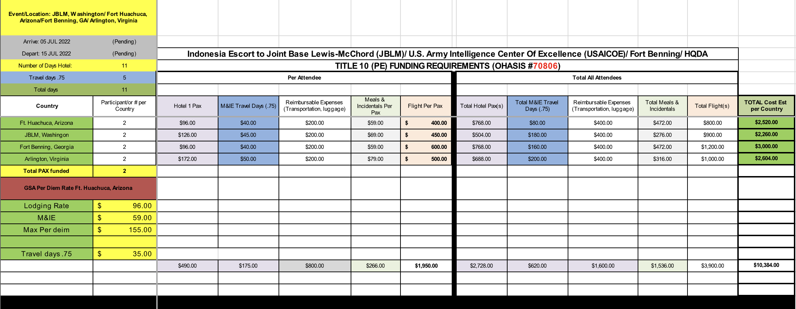

  

The Travel Cost Travel Cost Estimate calculator is an excel spreadsheet that I developed and managed in order to request funding to plan, prepare, and execute collaboration events between U.S. Army units and partner nations. The spreadsheet uses several different formulas that are able to be edited based on the location travel is happening, what the current allowable costs would be, and estimates total cost based on user input factors such as current plane ticket costs, average hotel rates, and other allowable expenses. The spreadsheet would go on to assist in the development of future software intended to better integrate the resource request process into the U.S. Army networking systems.

This project served as an initial means to better streamline the processes required to coordinate engagements with partner nation personnel. While during virtual meetings it was easy to say, "Let's meet in Hawaii next June for a conference", it was diffcult to plan for all the various aspects related to hosting an event. This spreadsheet formed the means to be able to expedite the calculation of cost estimates to allow for quicker approvals of reserving funds for the event.

While this project served as a means to an end, my time developing this increased my capabilities with excel and allowed for a better understanding of analyzing what factors are required when creating such a document - directly relating to anaylyzing the what is required of a code. I got to see this first hand while attending a coference that discussed the future software being developed specifically for partner capabilities, and saw how that spreadsheet helped to inform and affect capabilities within it.
